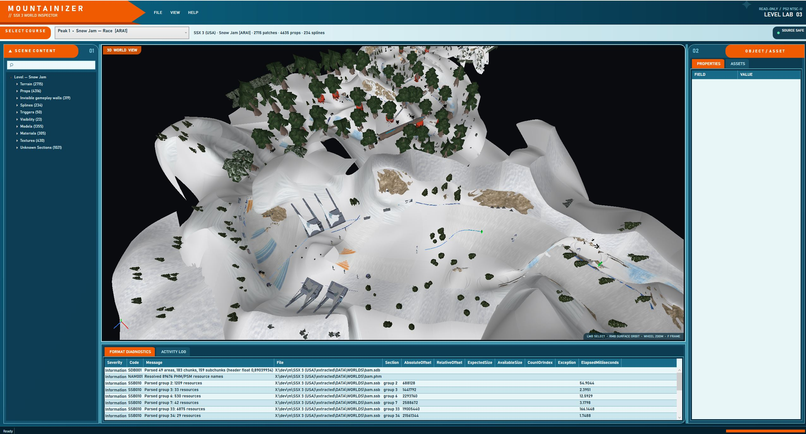

# Mountainizer


Mountainizer is an open-source, read-only **SSX 3 (PlayStation 2) world inspector** for Windows. It imports a user-provided NTSC-U disc image, assembles all 17 playable courses, and renders their terrain, props, textures, splines, triggers, and visibility data in an interactive OpenGL viewport.

Mountainizer contains no SSX 3 assets. It never modifies or repacks the source image; you must supply your own legally obtained copy of the game.



## Current features

- Imports and identifies the PS2 NTSC-U release (`SLUS_207.72`) from an ISO9660 image
- Presents all 17 courses by their in-game names, peak, discipline, and internal code
- Assembles each course from its event, shared-mountain, connector, and sky streaming areas
- Renders diffuse terrain plus decoded static props and models, using cached GPU instance batches and camera-frustum culling; decoded Type-10 lightmap atlases remain available for inspection
- Opens near the course's starting gate, facing downhill like the start of a race
- Provides surface-anchored orbit, adaptive cursor-directed zoom, pan, and fly controls
- Browses the scene hierarchy, properties, source offsets, materials, and decoded textures, with linked texture previews for terrain, materials, models, and props
- Visualizes splines, camera triggers, and visibility curtains as optional debug geometry
- Hides non-visual reset planes, gameplay volumes, triggers, ride-state meshes, and collision walls by default, with a dedicated debug toggle
- Exports tessellated terrain and decoded prop instances to OBJ with an MTL library and deduplicated PNG textures
- Preserves unsupported resources and reports structured parsing diagnostics
- Includes a CLI for identification, extraction, inspection, texture dumping, and export

Mountainizer currently targets inspection and reverse engineering. It is not a level editor and cannot write game data back to an ISO.

## Requirements

- Windows 10 or Windows 11, x64
- [.NET 8 SDK](https://dotnet.microsoft.com/download/dotnet/8.0) to build from source
- A legally obtained SSX 3 PS2 NTSC-U ISO for the fully tested workflow
- An OpenGL 3.3-capable graphics driver

Other disc revisions can be opened in best-effort, read-only mode, but have not been fully validated.

## Download

Download `Mountainizer.App.exe` from the [latest GitHub release](https://github.com/npiriou/mountainizer/releases/latest). It is a self-contained Windows x64 executable: no installer, ZIP archive, or separate .NET installation is required.

## Build and run

From the repository root:

```powershell
dotnet restore Mountainizer.sln
dotnet build Mountainizer.sln -c Release
dotnet run --project src/Mountainizer.App/Mountainizer.App.csproj -c Release
```

After building, the executable is located at:

```text
src\Mountainizer.App\bin\Release\net8.0-windows\Mountainizer.App.exe
```

Run the EXE from that directory and keep its companion DLLs and `runtimes` directory beside it. No ZIP or installer is required. The development build requires the .NET 8 Desktop Runtime.

## First run

1. Start `Mountainizer.App.exe`.
2. Choose **File → Import SSX 3 ISO**.
3. Select your legally obtained ISO.
4. Choose a parent directory and project name.
5. Select a course from the course menu after import completes.

Mountainizer creates a reusable local project cache. The source ISO remains read-only, and previously extracted files are reused when the project is reopened.

## Viewport controls

| Input | Action |
| --- | --- |
| Left mouse | Select the exact visible terrain or prop triangle under the cursor, or an enabled debug structure |
| Right mouse drag | Orbit around the track surface beneath the cursor |
| Middle mouse drag | Pan with distance-aware sensitivity |
| Mouse wheel | Zoom without changing the viewing direction |
| Ctrl + wheel | Precision zoom |
| Shift + wheel | Fast zoom |
| W/A/S/D | Fly forward, left, backward, and right |
| Q/E | Fly down and up |
| Shift + movement | Fly faster |
| F | Frame the selected item, or return from an isolated prop to the course |
| Escape | Clear the selection |
| Double-click a prop | Isolate and frame that prop |

Choose **View → Frame scene** to frame the complete course. Visual props are enabled by default. The **View → Prop / model categories** submenu independently controls visual, collision, reset-plane, gameplay-volume, trigger, ride-state, streaming, effect, and proxy instances. The same menu can hide one selected prop, show only its type, restore hidden props, or enable all types.

## Supported courses

| Peak 1 | Peak 2 | Peak 3 |
| --- | --- | --- |
| Snow Jam — Race (`ARA1`) | Ruthless Ridge — Race (`CRA3`) | Gravitude — Race (`ERA5`) |
| R&B — Slopestyle (`ASS1`) | Intimidator — Race (`DRA4`) | Kick Doubt — Slopestyle (`ESS3`) |
| Metro-City — Race (`BRA2`) | Style Mile — Slopestyle (`DSS2`) | Much-2-Much — Big Air (`EBA3`) |
| Crow's Nest — Big Air (`ABA1`) | Launch Time — Big Air (`CBA2`) | Perpendiculous — Super Pipe (`EHP3`) |
| Disfunktion — Super Pipe (`BHP1`) | Schizophrenia — Super Pipe (`CHP2`) | The Throne — Backcountry (`EBC3`) |
| Happiness — Backcountry (`ABC1`) | Ruthless — Backcountry (`DBC2`) | |

The 49 raw SDB streaming areas also remain available for technical inspection.

## CLI

Run the CLI during development with:

```powershell
dotnet run --project src/Mountainizer.Cli -- <command>
```

Available commands:

```text
identify <iso>
list-files <iso>
extract-file <iso> <iso-file-path> <output-path>
extract <iso> <project-directory>
import <iso> <project-directory> <project-name>
list-levels <project-or-project.json>
inspect <project> <course-or-area> [--json <output>]
dump-textures <project> <course-or-area> <output-directory>
export <project> <course-or-area> --format obj --output <directory>
```

For example, to list courses in an imported project and inspect Snow Jam:

```powershell
dotnet run --project src/Mountainizer.Cli -- list-levels "C:\Mountainizer\MyProject"
dotnet run --project src/Mountainizer.Cli -- inspect "C:\Mountainizer\MyProject" ARA1
```

See the [CLI reference](docs/cli.md) for command behavior and exit codes.

## Test

```powershell
dotnet test Mountainizer.sln -c Release
```

The normal suite uses synthetic fixtures and does not require copyrighted game data. To enable local regression tests against an imported project:

```powershell
$env:MOUNTAINIZER_TEST_PROJECT = "C:\Mountainizer\MyProject\project.json"
dotnet test src/Mountainizer.Tests/Mountainizer.Tests.csproj -c Release
```

Do not commit imported projects, extracted assets, or exports. Known game-data extensions are ignored, but always review changes before publishing.

## Repository layout

| Path | Purpose |
| --- | --- |
| `src/Mountainizer.App` | WPF desktop application |
| `src/Mountainizer.Cli` | Command-line interface |
| `src/Mountainizer.Core` | Scene model, diagnostics, and source metadata |
| `src/Mountainizer.Formats` | BIG, RefPack, SDB, SSB, terrain, model, and texture parsing |
| `src/Mountainizer.Iso` | Read-only ISO indexing, identification, and project cache |
| `src/Mountainizer.Rendering` | OpenTK/OpenGL renderer and camera |
| `src/Mountainizer.Export` | OBJ export |
| `src/Mountainizer.Tests` | Synthetic and opt-in local regression tests |
| `docs` | Architecture, format status, usage, and research notes |

## Documentation

- [User guide](docs/user-guide.md)
- [CLI reference](docs/cli.md)
- [Architecture](docs/architecture.md)
- [Format support status](docs/format-status.md)
- [Known limitations](KNOWN_LIMITATIONS.md)
- [Reference analysis](docs/reference-analysis.md)
- [Contributing](CONTRIBUTING.md)

## License

Mountainizer is released under the [MIT License](LICENSE). SSX 3 and its assets are the property of their respective rights holders and are not included with this project.
